# Agave Bendito — Base de documentación viva

> Este README define la **base documental del repositorio** y se debe actualizar en **cada cambio relevante de código, configuración, contenido, despliegue o seguridad**.

## Objetivo
Este repositorio contiene una instalación de WordPress para `agavebendito.com.mx` con plugins de e-commerce y un tema principal. Este documento estandariza la documentación mínima para operar, mantener y evolucionar el proyecto.

## Regla de actualización continua
- Cada PR/commit que modifique comportamiento, configuración o contenido operativo debe actualizar este README.
- Si el cambio no afecta una dimensión, se debe indicar explícitamente “sin cambios”.
- No exponer secretos (claves, contraseñas, tokens, salts, credenciales) en commits ni en documentación.

---

## Las 20 dimensiones de documentación obligatoria

### 1) Contexto de negocio y alcance
- Qué problema resuelve el sitio.
- Perfil de usuario principal.
- Alcance actual del repositorio (sitio WordPress + extensiones instaladas).

### 2) Inventario de componentes
- Core de WordPress.
- Tema activo.
- Plugins críticos (ej. WooCommerce, Elementor, formularios, seguridad, etc.).
- Contenido y carpetas operativas (`uploads`, `languages`, `maintenance`).

### 3) Arquitectura funcional
- Flujo de navegación principal.
- Embudo de compra/checkout (si aplica).
- Integraciones de marketing/comunicación.

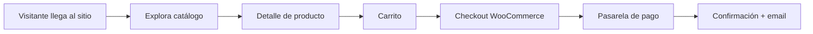

### 4) Arquitectura técnica
- Estructura de carpetas clave.
- Dependencias de servidor (PHP/MySQL/Apache/Nginx).
- Configuración crítica de arranque (`wp-config.php`).

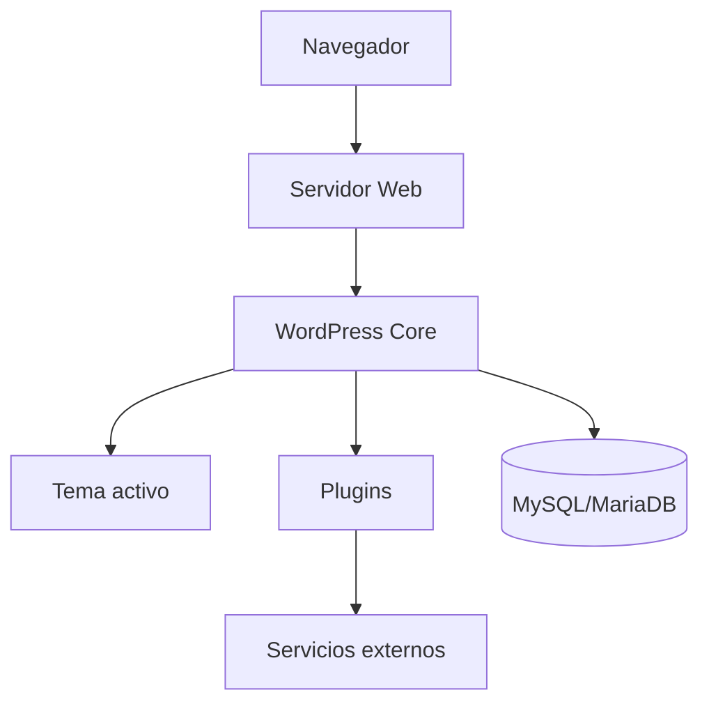

### 5) Configuración y entorno
- Variables/constantes relevantes (sin exponer valores sensibles).
- Convenciones por ambiente (local/staging/prod).
- Flags de depuración y restricciones de edición.

### 6) Seguridad y cumplimiento
- Buenas prácticas activas (ej. edición de archivos deshabilitada).
- Riesgos detectados y mitigaciones.
- Política de manejo de secretos y rotación.

### 7) Datos y persistencia
- Entidades clave (usuarios, productos, órdenes, formularios).
- Política de respaldo y restauración.
- Manejo de logs y retención.

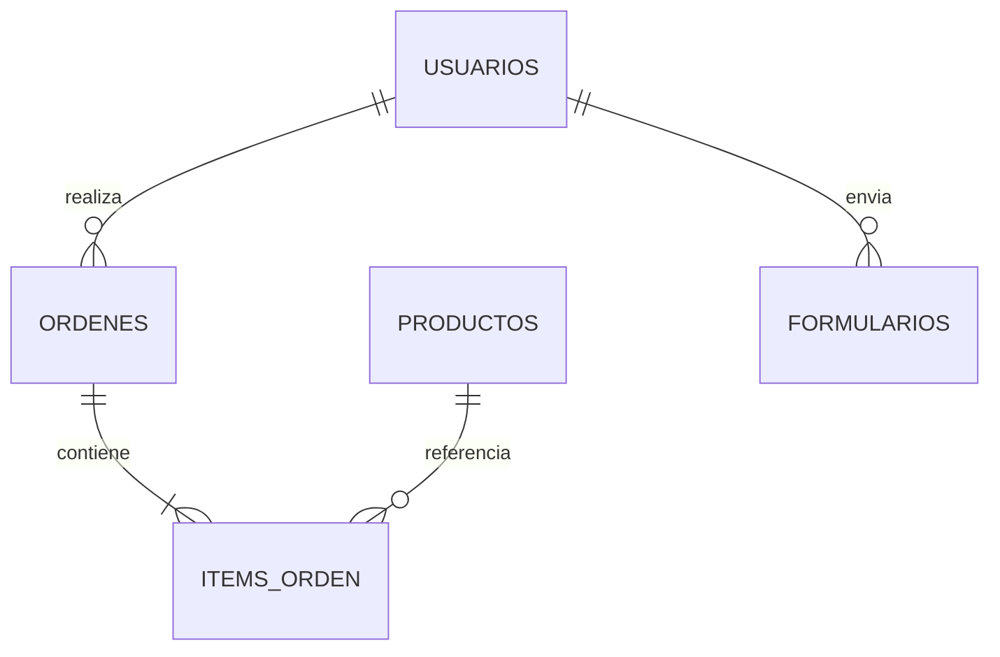

### 8) Integraciones externas
- Servicios conectados (pagos, email, analítica, CRM, etc.).
- Contratos/API dependientes.
- Impacto ante caída de terceros.

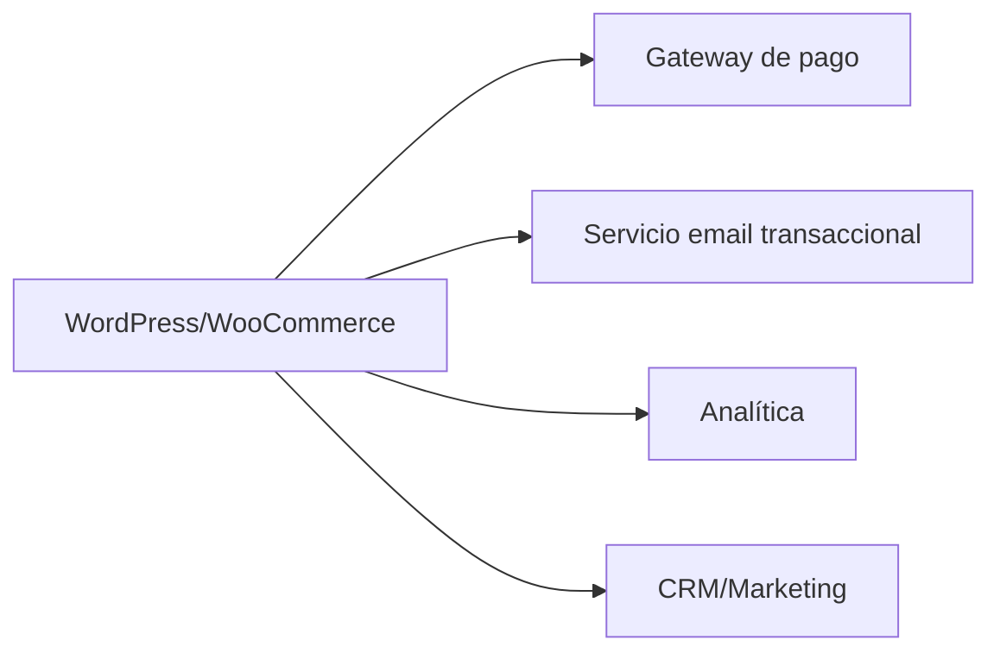

### 9) Operación diaria
- Tareas recurrentes (actualización de plugins, revisión de órdenes, limpieza de caché).
- Checklist de salud del sitio.
- Responsable sugerido por actividad.

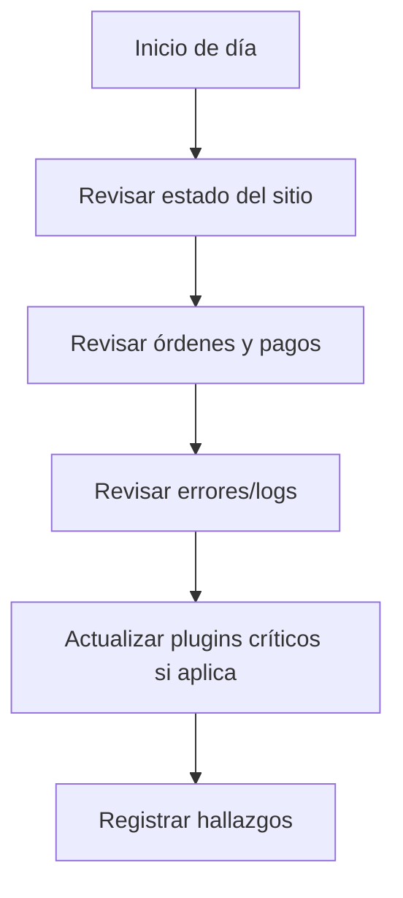

### 10) Build, release y despliegue
- Estrategia de versionado.
- Flujo de despliegue recomendado.
- Pasos de rollback.

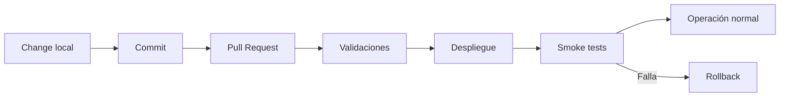

### 11) QA y pruebas
- Pruebas mínimas por cambio (smoke, checkout, formularios, admin).
- Evidencias requeridas (logs/capturas cuando aplique).
- Criterio de aceptación.

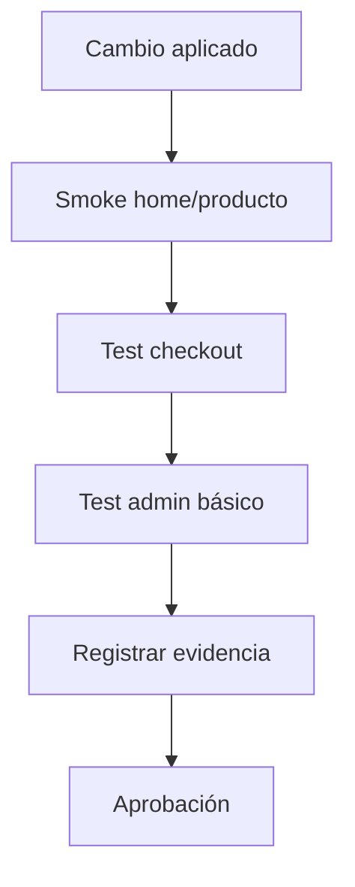

### 12) Observabilidad y monitoreo
- Qué métricas vigilar (errores, latencia, conversión, stock, pedidos).
- Dónde revisar errores (`error_log`, logs de plugins, logs WC).
- Umbrales para alertamiento manual/automático.

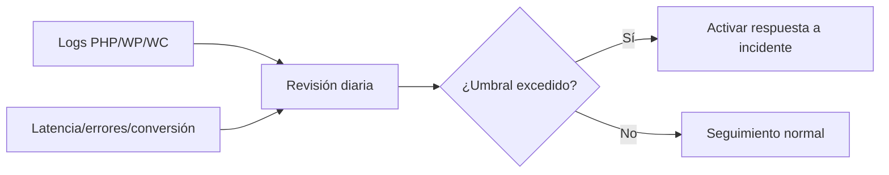

### 13) Rendimiento
- Objetivos de tiempo de carga.
- Prácticas de optimización de imágenes/assets.
- Revisión de plugins con alto consumo.

### 14) Contenido y SEO
- Flujo editorial.
- Gobernanza de URLs, metadatos y schema.
- Controles de indexación en cambios mayores.

### 15) Accesibilidad y UX
- Criterios mínimos (contraste, navegación teclado, etiquetas).
- Revisión de componentes críticos de compra.
- Hallazgos UX pendientes.

### 16) Incidentes y continuidad
- Procedimiento de respuesta a incidentes.
- Escalamiento y tiempos objetivo.
- Guía de recuperación de operación.

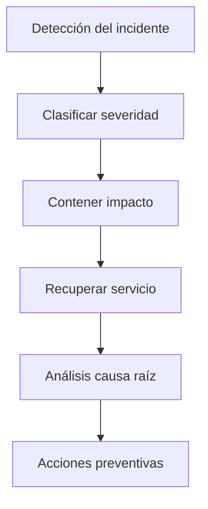

### 17) Deuda técnica y roadmap
- Deuda priorizada (seguridad, mantenimiento, limpieza de plugins).
- Mejoras planeadas por trimestre.
- Criterios para remover dependencias.

### 18) Gobierno de repositorio
- Convención de commits y PR.
- Regla de actualización de README + AGENTS por cambio.
- Política de revisión de cambios sensibles.

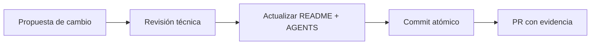

### 19) Onboarding de colaboradores
- Qué debe leer primero un nuevo integrante.
- Accesos mínimos requeridos.
- Errores comunes y cómo evitarlos.

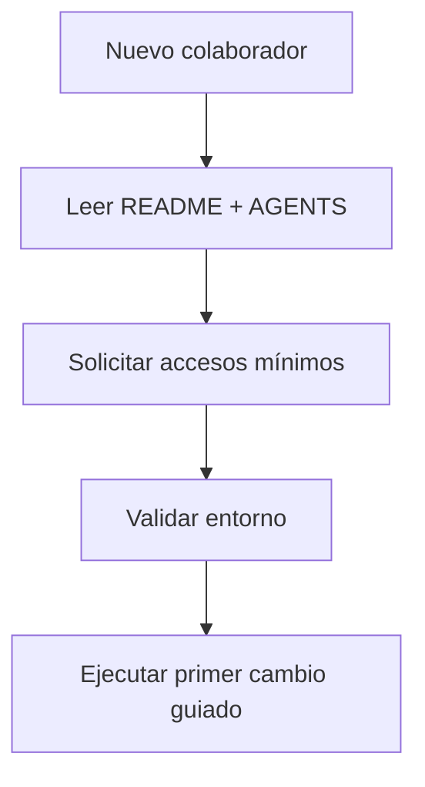

### 20) Bitácora de aprendizaje
- Lecciones aprendidas por cambio.
- Decisiones tomadas y trade-offs.
- Riesgos a vigilar en siguientes iteraciones.

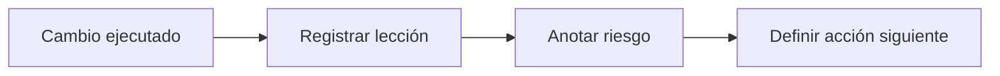

---

## Estado base inicial (versión 0)

### Resumen observado en este repositorio
- Proyecto basado en WordPress con estructura estándar (`wp-admin`, `wp-content`, `wp-includes`).
- Señales de tienda en línea por presencia de WooCommerce y extensiones relacionadas.
- Tema `shopstore` presente.
- Configuración de seguridad básica activa para deshabilitar editor de archivos en dashboard.

### Pendientes inmediatos sugeridos
1. Definir versión de WordPress/PHP/MySQL objetivo.
2. Documentar flujo oficial de despliegue y backup.
3. Crear tablero de monitoreo mínimo (errores PHP, errores checkout, estado de pedidos).
4. Registrar responsables por dimensión.

---

## Plantilla de actualización por cambio
Copiar este bloque en cada actualización significativa:

```md
### Actualización YYYY-MM-DD
- Cambio realizado:
- Dimensiones impactadas: [1, 2, ...]
- Riesgo introducido:
- Mitigación aplicada:
- Validación ejecutada:
- Lección aprendida:
```

## Criterio de “Done” documental
Un cambio se considera completo solo si:
- [ ] Código/configuración actualizado.
- [ ] README actualizado en dimensiones impactadas.
- [ ] AGENTS.md actualizado con aprendizaje operativo.
- [ ] Validación mínima registrada.
